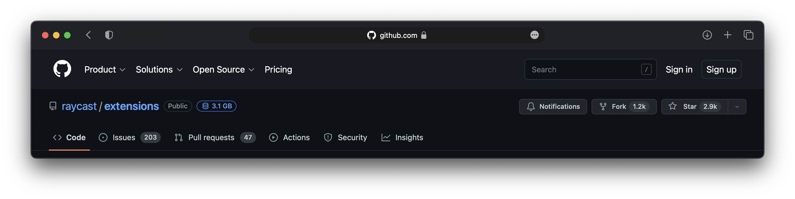
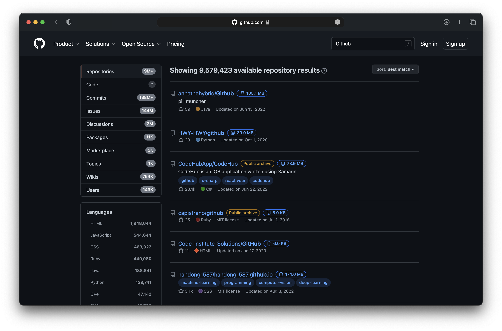

  <h1 align="center">Github Repo Size</h1>

A userscript that adds the size of Github repositories to the search results and repository pages.

## Preview

## Prerequisites

To use this script, you will need a userscript manager. Some popular choices are:

- [Tampermonkey](https://tampermonkey.net/) (Chrome, Firefox, Safari, Microsoft Edge, Opera Next)
- [Violentmonkey](https://violentmonkey.github.io/) (Chrome, Firefox, Microsoft Edge)
- [Greasemonkey](https://www.greasespot.net/) (Firefox)
- [Userscripts](https://apps.apple.com/us/app/userscripts/id1463298887) (Safari)

## Installation

1. Install Tampermonkey or your preferred userscript manager.
2. Install the script from [here](dl.link).
3. (Optional) To avoid rate limiting, generate a new public access token from [Github settings/tokens](https://github.com/settings/tokens) and replace the 'TOKEN' constant in the script with your token. See [View Private Repositories Size](#view-private-repositories-size) for more details.

## View Private Repositories Size

By default, this script will only display the sizes of public repositories.
To display the sizes of private repositories, you will need to generate a new personal access token with the `repo` scope.
This token will be used to authenticate with the Github API.

1. Generate a new personal access token from [Github settings/tokens](https://github.com/settings/tokens) and click on the `Generate new token` button.
2. Give the token a name and check the `repo` scope.
3. Click on the `Generate token` button and copy the token.
4. Replace the value of the `TOKEN` constant in the script with your token.

## Usage

This script will automatically run on Github search pages and repository pages, and will display the repository size next to the repository name.

## Support

If you have any issues or feedback, please open an issue on the [Github Repo](https://github.com/mshll/repo-size).

## Disclaimer

This This script is not affiliated with Github, Inc. Use it at your own risk.
